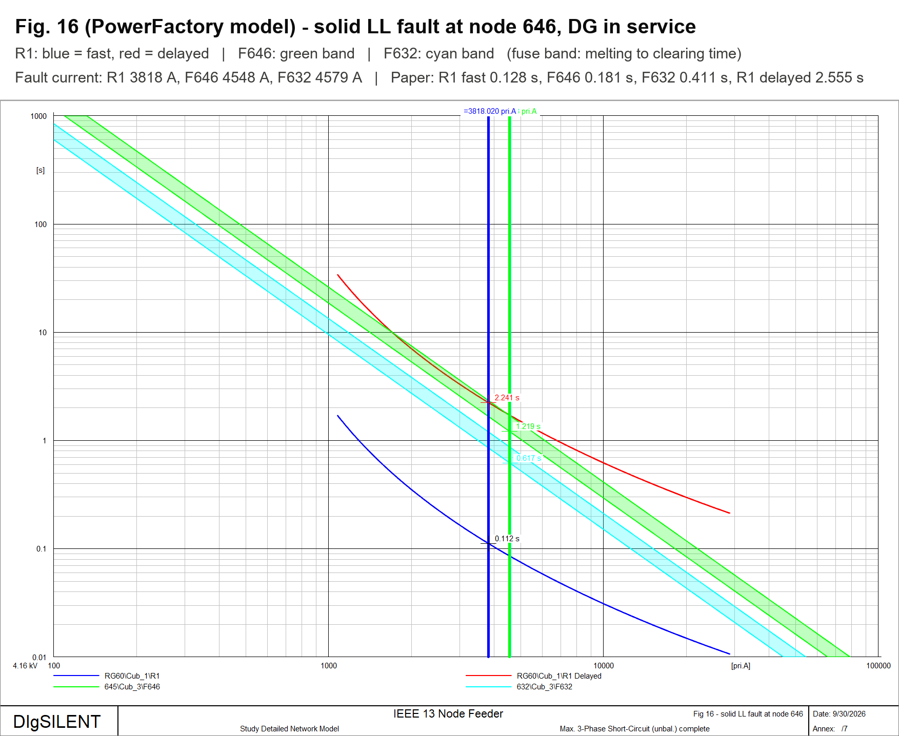
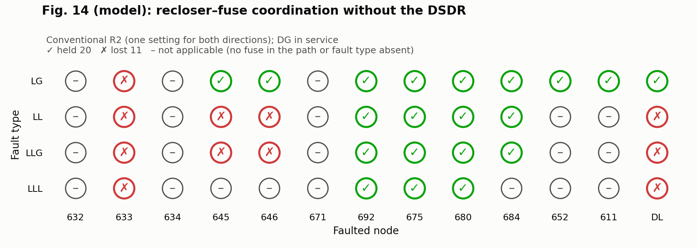
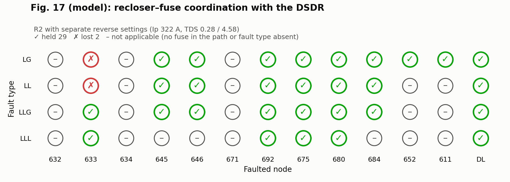

# IEEE 13-Bus Feeder in DIgSILENT PowerFactory – Recloser–Fuse Coordination with a Dual-Setting Directional Recloser

Replication of the IEEE 13-node part of

> M. Yousaf, A. Jalilian, K. M. Muttaqi, D. Sutanto, "An Adaptive Overcurrent Protection Scheme for
> Dual-Setting Directional Recloser and Fuse Coordination in Unbalanced Distribution Networks With
> Distributed Generation," *IEEE Trans. Ind. Appl.*, vol. 58, no. 2, pp. 1831–1842, 2022.
> doi:[10.1109/TIA.2022.3146095](https://doi.org/10.1109/TIA.2022.3146095)

in DIgSILENT PowerFactory 2021 SP2, with Python scripts for every table and figure.
A summary of the results is in [`Result/Progress_Report.pdf`](Result/Progress_Report.pdf).

## Status

| Paper item | Status | Where |
| --- | --- | --- |
| Table I – DG data | in the model, not re-checked | `IEEE 13 Node Feeder.pfd` |
| Table II – rated / min / max branch currents | done | `Result/Table_II.csv` |
| Table III – fuse coefficients b<sub>i</sub> | done | `Result/Table_III.csv` |
| Table IV – R1, R2 and fuse operating times | done | `Result/Table_IV_model.csv` |
| Fig. 6 – reclosers and 15 fuses | placed in the model | `Configure_Reclosers.py`, `Add_Fuses.py` |
| Fig. 7 – CTI vs DG penetration | done | `Result/Figures/Fig07_CTI_vs_DG.png` |
| Figs. 8, 9, 11, 12, 13, 16 – operation sequences | done, drawn by PowerFactory | `Result/PF_Figures/` |
| Fig. 15 – R2 as dual-setting recloser | calculated in Python | `Result/Figures/Fig15_LL_646_DSDR_R2.png` |
| Figs. 14, 17 – coordination maps | done | `Result/Figures/`, Output Window |
| Fig. 10 – time-domain fault current | not started | needs an RMS/EMT simulation |
| IEEE 34-node system (Figs. 18–21, Table V) | not started | |

## Quick start

1. Import `IEEE 13 Node Feeder.pfd` (File › Import › Data) and activate the project.
2. Select Python 3.9 under Tools › Configuration › Python (PowerFactory 2021 SP2 supports 3.6–3.9).
   Pillow is needed for the image titles; reportlab and matplotlib for the report and Python figures.
3. Open the single-line diagram, create a Python Script (ComPython) in the study case pointing to
   **`Show_Progress.py`**, and Execute. The Output Window shows Tables II–IV and Figs. 14 and 17
   (model next to the paper), and the plot pages *Fig 8* … *Fig 16* are drawn. Everything is saved
   in `Result/`.

Each figure's fault is also saved as a short-circuit command *Fault Fig 8*, *Fault Fig 9*, … in the
study case. Only one short-circuit result exists at a time: execute a figure's command to show its
fault-current lines again on its page.

## Scripts

Run inside PowerFactory unless marked *Python*.

| # | Script | Does | Output |
| --- | --- | --- | --- |
| 1 | `IEEE13_Tables.py` | Load flow and short circuits for Tables II and III | `Result/Table_II.csv`, `Table_III.csv` |
| 2 | `Configure_Reclosers.py` | Sets up R1 and R2 as GE IAC77B801A relays, one relay per fast / delayed curve | settings in the model |
| 3 | `Add_Fuses.py` | Adds the 15 fuses of Fig. 6 with eq. (6) curves and the Table III b<sub>i</sub> | fuses in the model |
| 4 | `Fault_Study.py` | Fault currents through R1, R2 and every fuse: figure faults, every node × LG/LL/LLG/LLL, DG penetration | `Result/Fault_Study.csv` |
| 5 | `make_figures.py` (*Python*) | Operating times and coordination from the fault study | `Result/Figures/`, `Result/Table_IV_model.csv` |
| 6 | `Table_IV.py` | Table IV in the Output Window, model and paper | Output Window |
| 7 | `Fig14_Coordination.py` | Fig. 14 (or Fig. 17 with `DSDR = True`) in the paper's layout, model and paper | Output Window |
| 8 | `Figure_Plots.py` | Time-overcurrent plot pages for Figs. 8, 9, 11, 12, 13, 16, with the figure's fault applied, exported with a title | pages *Fig 8 – …*, `Result/PF_Figures/` |
| – | `Show_Progress.py` | Runs 1, 6, 7 (Figs. 14 and 17) and 8 in one go | Output Window, `Result/Show_Progress_output.txt` |
| – | `make_report.py` (*Python*) | Builds the progress report from `Result/` | `Result/Progress_Report.pdf` |

Scripts 2–4 only need to run again if the model or settings change; after 4, run 5 and
`make_report.py`.

## Model and settings

- IEEE 13-node feeder, 4.16 kV, 60 Hz; 4.05 MVA / 0.69 kV synchronous DG at node 692 through a
  0.69/4.16 kV transformer (Table I).
- Short circuits use the **Complete** method: the IEC/ANSI methods are balanced and cannot represent
  the single-phase regulators and the one- and two-phase laterals.

| Device | Location | Setting |
| --- | --- | --- |
| R1 | RG60 end of line 650–632 | GE IAC extremely inverse, pickup 720 A (CT 900/5, tap 4 A), TDS 0.5 / 10 – as in the paper |
| R2 forward | 671 end of line 632–671 | pickup 600 A (CT 1000/5, tap 3 A), TDS 0.8 / 4.0 – not given in the paper, fitted to Table III |
| R2 reverse (DSDR) | same | pickup 322 A = 1.25 × 257.8 A reverse load current with the DG (eq. 12), TDS 0.276 / 4.582 chosen by step 8 of the method; calculated in Python, not yet a relay in the model |
| 15 fuses | Fig. 6 | minimum melting time log<sub>10</sub>(t) = −1.8·log<sub>10</sub>(I) + b<sub>i</sub> (eq. 6) with the paper's Table III b<sub>i</sub>; clearing at 1.21 × the melting current (band width of the Gould-Shawmut A055B library fuse used as template) |

**Table II:** I<sub>nom</sub> from the unbalanced load flow; I<sub>f,max</sub> from a bolted three-phase fault
at the downstream node with maximum short-circuit currents (line-line or line-ground at 645, 646, 684 /
611, 652, where a three-phase fault cannot exist); I<sub>f,min</sub> from a single line-to-ground fault
through 3 Ω at the farthest node with minimum currents. DG out of service.

**Coordination (Figs. 14, 17):** held when every recloser feeding the fault trips on its fast curve before
the primary fuse melts, and the fuse clears before the recloser's delayed trip. Upstream of R2 both R1
(grid) and R2 (DG, reverse) feed the fault.

## Results

| | Model vs paper |
| --- | --- |
| Table II, rated currents | within 1 % on every branch |
| Table II, I<sub>f,min</sub> | within 20 % |
| Table II, I<sub>f,max</sub> | within 20 % on 9 of 13 branches |
| Table III, b<sub>i</sub> | 11 of 15 within 0.1 |
| R1 at the paper's operating points | within 1–4 % |
| Fig. 14 (without DSDR) | 23 of 31 comparable cells agree |
| Fig. 17 (with DSDR) | 29 of 31 agree |

Without the DSDR, recloser–fuse coordination is lost for faults upstream of R2; with R2's separate
reverse setting it is restored – the paper's main result.






### Differences from the paper

- **Fuse curves.** The fuse times in the paper's figures cannot be obtained from its eq. (6) with its
  Table III b<sub>i</sub> (e.g. F646: b ≈ 5.67 from the figures, 6.67 in Table III), and its fuse bands are
  curved like library fuses. The model follows eq. (6) and Table III.
- **Series fuses.** With the Table III b<sub>i</sub> the upstream fuse melts before the downstream one in all
  four series pairs, against the paper's own 75 % rule (eq. 8).
- **R2 settings** are not published; the forward setting is fitted to Table III, the reverse one derived
  with eq. (12) and step 8 of the method.
- **Fault levels.** The paper's I<sub>f,max</sub> at 680 and 675 exceed its own value at the feeder head.

Comparisons at the paper's own currents are in `Result/Paper_comparison_operating_points.csv` and
`Result/Paper_comparison_TableIV.csv`.

## Notes

- `Show_Progress.py` gives all scripts one shared PowerFactory Application object and releases it at the
  end; calling `GetApplication()` more than once in a run invalidates the first one
  ("'powerfactory.Application' already deleted").
- The scripts close R1's breaker at RG60 if they find it open (an open breaker de-energises the feeder).
- `Figure_Plots.py` leaves the DG in service. `Fault_Study.py` and `Table_IV.py` use the study case's
  short-circuit setting; the plot pages currently use maximum currents, the fault study minimum ones.
- "Short-circuit calculation not possible" messages during a run are expected: the scripts try every
  phase (pair) at one- and two-phase nodes.

## Repository layout

```
IEEE 13 Node Feeder.pfd / .pdf    PowerFactory project and single-line diagram
*.py                              scripts (above)
Result/                           tables, fault study, figures, PowerFactory plots, report
Result/Logs/                      run logs (not tracked)
Archive/                          earlier work (not tracked)
```
